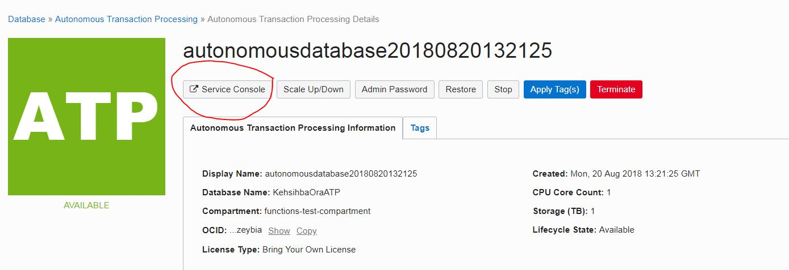
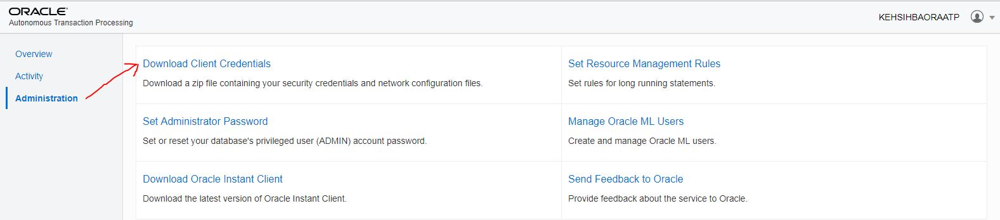

# Integrating Oracle Functions with Oracle Autonomous Transaction Processing

Fn functions executing `CRUD` operations on Oracle ATP. This sample uses a simple `Employee` entity for demonstration purposes 

##  Oracle ATP setup

Start by cloning or downloading this repository

### Provision Oracle ATP

If you haven't already provisioned an Oracle ATP instance, follow the [setup guide](https://docs.oracle.com/en/cloud/paas/atp-cloud/atpug/getting-started.html#GUID-0B230036-0A05-4CA3-AF9D-97A255AE0C08)

### Get client credentials

You must obtain client security credentials to connect to Autonomous Transaction Processing. You obtain a zip file containing client security credentials and network configuration settings required to access Autonomous Transaction Processing. You must protect this file to prevent unauthorized database access.

To [download client credentials from ATP](https://docs.oracle.com/en/cloud/paas/atp-cloud/atpug/connect-download-wallet.html#GUID-B06202D2-0597-41AA-9481-3B174F75D4B1) log into your OCI a/c and locate the Oracle ATP instance you want to work with and access it's **Service Console**



Once you download the ZIP file, extract its contents and copy them to all the function folders - `create`, `read`, `update`, `delete`

> the contents are as follows - `cwallet.sso`, `ewallet.p12`, `keystore.jks`, `ojdbc.properties`, `sqlnet.ora`, `tnsnames.ora`, `truststore.jks`



### Create a user

**Connect to Oracle ATP**

One way is using [SQL Developer](https://docs.oracle.com/en/cloud/paas/atp-cloud/atpug/connect-sql-dev182.html#GUID-14217939-3E8F-4782-BFF2-021199A908FD)

In addition to default `ADMIN` user created during setup, you need to [create another user](http://www.oracle.com/webfolder/technetwork/tutorials/obe/cloud/atp/obe_provisioning%20autonomous%20transaction%20processing/provisioning_autonomous_transaction_processing.html#CreateaUserinyourAutonomousTransactionProcessingDatabase) for database operations

> Replace `username` and `password` with appropriate values

   
   >```
   > create user <username> identified by "<password>";
     grant dwrole to <username>;
	 ALTER USER <username> quota unlimited on DATA;
   >```

### Seed database

Create `Employee` table - use `seed-db.sql`

### Configure Oracle Maven repository

This application uses Oracle JDBC driver which is extracted from the Oracle Maven repository. To access the Oracle Maven Repository, you must first register for access on Oracle Technology Network (if you haven't already). You can access the registration application at https://www.oracle.com/webapps/maven/register/license.html

This application displays the license agreement for access to the Oracle Maven Repository. You must accept the license agreement to access the Oracle Maven Repository. 

For further details, please refer to https://docs.oracle.com/middleware/1213/core/MAVEN/config_maven_repo.htm#MAVEN9010


## Create an app with required database configuration

   
   >```
   > fn create app --annotation oracle.com/oci/subnetIds='["<subnet OCID>"]' --config DB_PASSWORD=<password> --config DB_SERVICE_NAME=<db service> --config DB_USER=<db user> --config CLIENT_CREDENTIALS=/function fn-oracle-atp-app
   >```

e.g. `fn create app --annotation oracle.com/oci/subnetIds='["ocid1.subnet.oc1.phx.aaaaaaaaghmsma7mpqhqdhbgnby25u2zo4wqlrrcskvu7jg56dryxt3hgvka"]' --config DB_PASSWORD=s3cr3t --config DB_SERVICE_NAME=orafoo_high --config DB_USER=foobar --config CLIENT_CREDENTIALS=/function fn-oracle-atp-app`

Here is a summary of the configuration parameters

- `DB_USER` - Name of the database user created in the `Create a user` section 
- `DB_PASSWORD` - Database user password
- `DB_SERVICE_NAME` - JDBC connection string which is a [pre-defined service name](https://docs.oracle.com/en/cloud/paas/atp-cloud/atpug/connect-predefined.html#GUID-9747539B-FD46-44F1-8FF8-F5AC650F15BE)
- `CLIENT_CREDENTIALS` - This is the directory (within the Docker container) where the downloaded credentials are placed. It is defined in the `Dockerfile` and you can use `/function` as the value for this configuration parameter

> **Connecting to Oracle ATP** - Oracle Wallet is used to connect with Oracle ATP instance using the 18.3 JDBC Thin Driver. Details here - https://docs.oracle.com/en/cloud/paas/atp-cloud/atpug/connect-jdbc-thin-wallet.html#GUID-20656D84-4D79-4EE9-B55F-333053948966

## Build process

A custom Dockerfile is used to build the function(s). The build process accepts the OTN username and password along with a master password as inputs. The master password itself is encrypted using `mvn --encrypt-master-password` and it is then used  to encrypt your OTN credentials. The encrypted master password is stored in `settings-security.xml` and the encrypted OTN credentials are stored in `settings.xml`. These XMLs are then referred by `mvn package`.

The second stage of the build process extracts and copies the required Oracle ATP credentials to the container

## Deploy

> Use your OTN username and password (created in the **Configure Oracle Maven repository** step) for `ORACLE_USERID` and `ORACLE_PASSWORD` respectively. You can use any value for the `MASTER_PASSWORD`

### Deploy all the functions at once

   
   >```
   > cd fn-oracledb-atp-sample
   >```
   
   
   
   >```
   > fn -v deploy --app fn-oracle-atp-app --build-arg MASTER_PASSWORD=<maven_master_password> --build-arg ORACLE_USERID=<OTN_USERNAME> --build-arg ORACLE_PASSWORD=<OTN_PASSWORD> --all
   >```

e.g. `fn -v deploy --app fn-oracle-atp-app --build-arg MASTER_PASSWORD=foobar --build-arg ORACLE_USERID=abhishek.af.gupta@oracle.com --build-arg ORACLE_PASSWORD=t0ps3cr3t --all`


> Notice the usage of `--all` flag at the end of the `deploy` command. It uses the app name as specified in `app.yaml`

### Deploy one function at a time

For example, to deploy the `create` function

   
   >```
   > cd fn-oracledb-atp-sample/create
   >```


   
   >```
   > fn -v deploy --app fn-oracle-atp-app --build-arg MASTER_PASSWORD=<maven_master_password> --build-arg ORACLE_USERID=<OTN_USERNAME> --build-arg ORACLE_PASSWORD=<OTN_PASSWORD>
   >```


*Repeat for other functions*

## Check

Run `fn inspect app fn-oracle-atp-app` to check your app (and its config) and `fn list functions fn-oracle-atp-app` to check associated functions

## Test

### Create Employee

`echo -n '{"emp_email": "a@b.com","emp_name": "abhishek","emp_dept": "Product Divison"}' | fn invoke fn-oracle-atp-app create-emp`

If successful, you should a response similar to this `Created employee CreateEmployeeInfo{emp_email=a@b.com, emp_name=abhishek, emp_dept=Product Divison}`

Create as many as you want - make sure that the `emp_email` is unique

### Read Employee(s)

- `fn invoke fn-oracle-atp-app read-emp` (to fetch all employees)

You should get back a JSON response similar to below

	[
	  {
	    "emp_email": "y@z.com",
	    "emp_name": "abhishek",
	    "emp_dept": "PM"
	  },
	  {
	    "emp_email": "a@b.com",
	    "emp_name": "abhishek",
	    "emp_dept": "Product Divison"
	  },
	  {
	    "emp_email": "x@y.com",
	    "emp_name": "kehsihba",
	    "emp_dept": "QA Divison"
	  }
	]

- `echo -n 'a@b.com' | fn invoke fn-oracle-atp-app read-emp` (to fetch employee with email `a@b.com`)

		[
		  {
		    "emp_email": "a@b.com",
		    "emp_name": "abhishek",
		    "emp_dept": "Product Divison"
		  }
		]

### Update Employee

It is possible to update the department of an employee

`echo -n '{"emp_email": "a@b.com", "emp_dept": "Support Operations"}' | fn invoke fn-oracle-atp-app update-emp`

Successful invocation will return back a message similar to `Updated employee UpdateEmployeeInfo{emp_email=a@b.com, emp_dept=Support Operations}`

Check to make sure - `echo -n 'a@b.com' | fn invoke fn-oracle-atp-app read-emp` - the updated department should reflect

		[
		  {
		    "emp_email": "a@b.com",
		    "emp_name": "abhishek",
		    "emp_dept": "Support Operations"
		  }
		]

### Delete Employee

Use employee email to specify which employee record you want to delete

`echo -n 'a@b.com' | fn invoke fn-oracle-atp-app delete-emp` and you should see `Deleted employee a@b.com` message

Check to make sure - `echo -n 'a@b.com' | fn invoke fn-oracle-atp-app read-emp`
